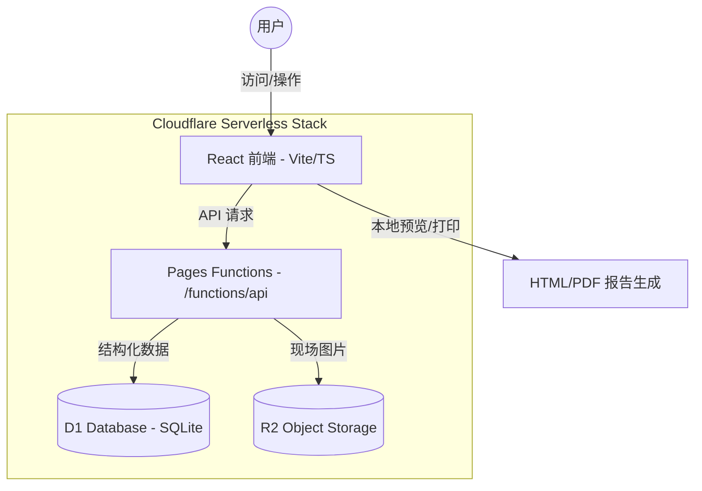

# 勘探报告工具 (PV Site Survey Tool)

一个用于创建和管理光伏现场勘探/踏勘报告的 Web 应用，专为移动端优化。本项目已全面迁移至 **Cloudflare Pages Functions + D1 + R2** 一体化 Serverless 架构，彻底弃用 Supabase 与 NAS 自建方案。

## 🏗 系统架构

本项目采用前后端分离但全栈托管在 Cloudflare 的现代架构：



## ✨ 功能概览

- **项目管理**: 首页展示项目列表（状态：踏勘中/已完成），支持快速新建与编辑。
- **标准化踏勘**: 模块化录入厂区概况、建筑屋面、电气设施与资料收集情况。
- **多端适配**: 移动端优先设计，支持扫码上传图片与现场录入；支持电脑视图切换，便于集中编辑。
- **报告生成**: 本地生成结构化 HTML 报告，支持一键打印为 PDF 或导出结构化 JSON 数据。
- **持久化同步**: 所有项目数据与图片均自动同步至云端 D1 数据库与 R2 存储。

## 🛠 技术栈

- **前端**: React 19 + TypeScript + Vite + Tailwind CSS
- **后端**: Cloudflare Pages Functions (Edge Runtime)
- **数据库**: Cloudflare D1 (SQLite)
- **对象存储**: Cloudflare R2 (S3 Compatible Storage)

## 📁 目录结构

```text
.
├── functions/              # 后端 API (Cloudflare Pages Functions)
│   └── api/
│       └── [[route]].ts    # 统一路由处理 (D1 + R2 交互逻辑)
├── components/             # 前端组件 (Views, Editor, Common)
├── services/               # 前端服务层 (projectApi.ts, formConfigs.ts)
├── types.ts                # 核心类型定义 (Project, ReportData)
├── backend/                # 历史脚本与数据库 Schema (schema.sql)
├── wrangler.toml           # Cloudflare 资源绑定配置
└── vite.config.ts          # Vite 构建配置
```

## 🚀 快速开始

### 1. 环境准备
- Node.js ≥ 18
- Cloudflare 账号（及已安装的 Wrangler CLI）

### 2. 初始化资源
```bash
# 创建 D1 数据库并记录 ID
npx wrangler d1 create tk-report-db

# 初始化数据库表结构
npx wrangler d1 execute tk-report-db --file=./backend/schema.sql

# 创建 R2 图片存储桶
npx wrangler r2 bucket create tk-report-images
```

### 3. 本地运行
```bash
# 安装依赖
npm install

# 启动开发服务器 (同时运行前端与 Functions 后端)
npx wrangler pages dev . --d1 DB=your-db-id --r2 IMAGES=tk-report-images
```

### 4. 部署
```bash
# 构建前端
npm run build

# 部署至 Cloudflare Pages
npx wrangler pages deploy dist
```

## 💡 开发进阶

- **业务逻辑**: 修改 `services/formConfigs.ts` 即可扩展踏勘表单字段。
- **API 扩展**: 在 `functions/api/[[route]].ts` 中添加新的 REST 接口。
- **数据导出**: 利用生成的 `ReportData` JSON 结构，可轻松对接大模型进行自动化风险评估。

---
*初始工程由 AI Studio 生成，现已演进为全栈 Serverless 生产级工具。*